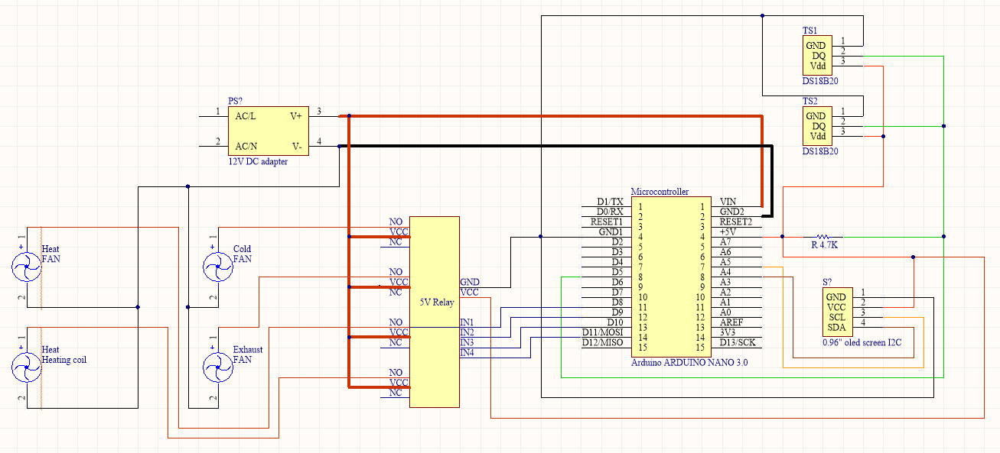

### Arduino 3d printer enclosure environmental control
I needed to build an enclosure for my 3D printers, and as it was going to be in a pretty cold room,
I needed to create some environmental control to heat it up, but also to cool it down.
The purpose is to keep the temperature inside the enclosure between 19C and 24C.
In order to do so, several fans will be used:
1. Heating fan
2. Cooling fan
3. Exhaust fan

All those fans will be controlled by an Arduino.
Some temperature sensors will also be used to start and stop the fans when the required temperature
is correct inside the enclosure. 

Schematics to come when designed. 

Currently starting the project.